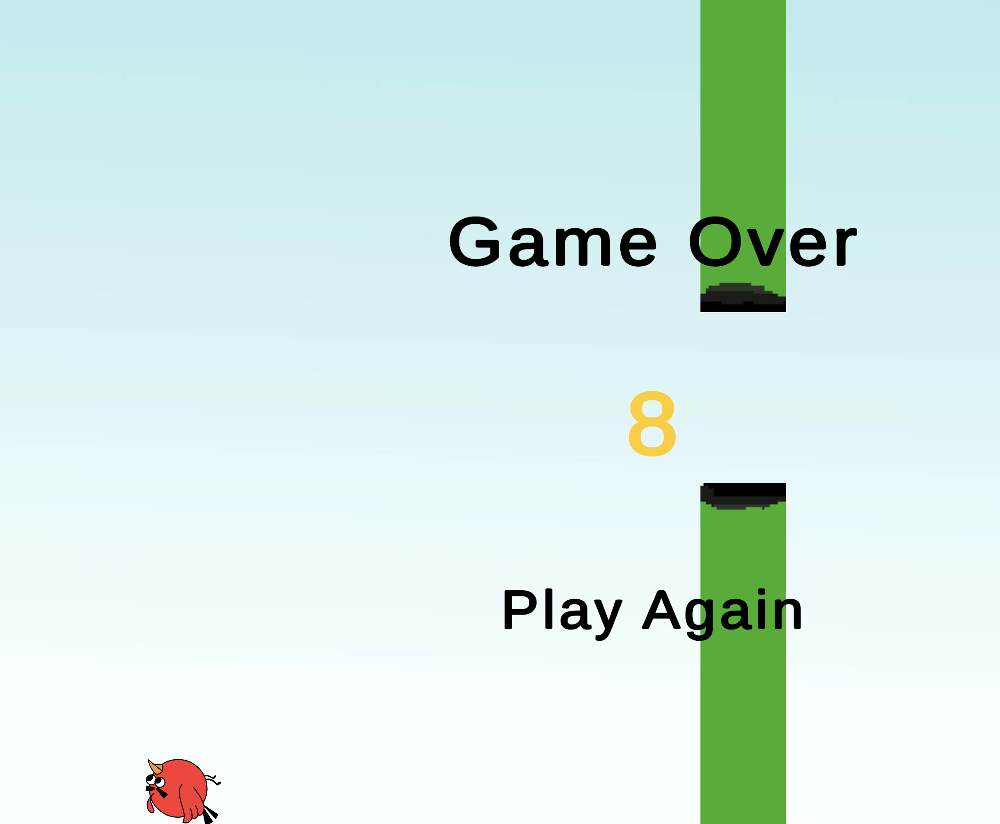
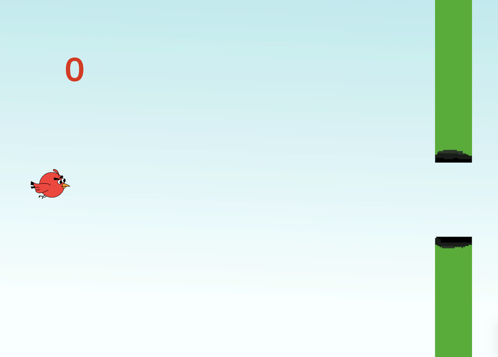

# Flappy Bird Clone

A simple Flappy Bird clone made with Unity.

This project was created as a learning exercise while I am studying Computer Engineering. My goal was not only to recreate the original game but also to improve my understanding of Unity and C# by building everything from scratch.

## Features

- Classic Flappy Bird gameplay
- Score system
- High score saving
- Game Over screen
- Restart functionality
- Simple UI and animations

## What I Learned

- Saving and loading data using PlayerPrefs
- Managing game states (Playing / Game Over)
- Detecting collisions using colliders and triggers
- Creating and updating UI elements
- Spawning obstacles using prefabs
- Handling player input and game restart logic
  
## Technologies

- Unity
- C#

## Screenshots

## About This Project

I am a Computer Science student and I use projects like this to improve my game development and programming skills.

Every project I build teaches me something new, and this repository is part of my learning journey.

Feedback and suggestions are always appreciated!
